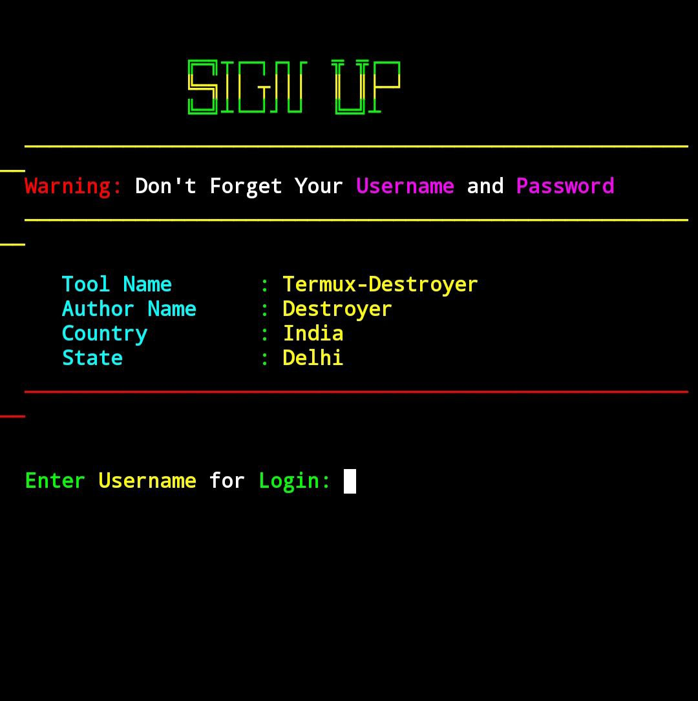
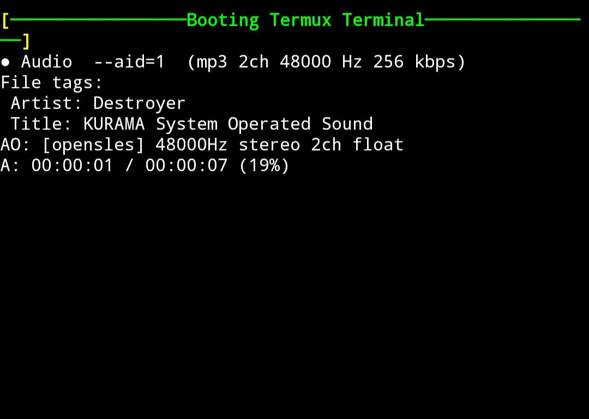

<h1 align="center">Termux-Destroyer</h1>

## Description
Termux-Destroyer is a customization toolkit designed to enhance the default Termux environment through structured configuration scripts. It enables users to implement a custom login interface, integrate interactive sound effects, and personalize shell identity settings. The project focuses on controlled terminal customization to create a more distinctive and engaging command-line experience while maintaining usability and structure.

# What is Termux?
Termux is an Android-based terminal emulator that provides a lightweight Linux environment without requiring root access. It installs a minimal base system upon setup and allows users to manage additional tools and packages using the built-in pkg and apt package managers. This makes it a powerful platform for development, automation, and command-line experimentation directly on Android devices.
For official documentation and updates, visit the Termux website.

# How to Install Termux
Termux can be installed on Android devices through trusted distribution sources such as F-Droid or GitHub Releases. After installation, launch the application to initialize the base system. Once initialized, you can update the package repository and begin installing required tools using:
                                 pkg update && pkg upgrade
It is recommended to keep the environment updated to ensure stability and access to the latest package versions.

You can install Termux from F-Droid.

- Get it on [Github](https://github.com/termux/termux-app)
- Download from [F-Droid](https://f-droid.org/packages/com.termux/)

> **Note:** We do not recommend installing Termux from the **Google Play Store** as it is currently unmaintained.

> **Recommendation:** We strongly advise installing Termux from **F-Droid** as it is the stable and maintained version.

## Screenshots After Installation
### Signup Screen

### Login Screen

### Booting Screen

### Termux Terminal


## Key Features
- [x] Custom Login Screen
- [x] immersive Login Sound Effects
- [x] Customizable Shell Name
- [x] Interactive Terminal Experience
- [X] User-Friendly Interface
- [X] Simple Installation Process
- [X] Integrated Terminal Clock
- [X] High-Performance Aesthetics
> These features significantly enhance the Termux interface, providing users with a personalized, dynamic, and professional experience.


## Getting Started
To get started, simply follow the provided commands to update and upgrade your Termux environment, clone the Termux-Destroyer repository, and execute the setup script to apply the customizations. This repository is intended for educational purposes.

[-] Update and Upgrade your package lists to the latest versions:
    ```
    apt update && apt upgrade
    ```

[-] Install Git in Termux
    ```
    pkg install git
    ```
    
[-] Clone the Termux-Destroyer repository:
    ```
    git clone https://github.com/CaptainDestroyer/Termux-Destroyer.git
    ```

[-] Navigate to the cloned repository directory:
    ```
    cd Termux-Destroyer
    ```

[-] Add execute permissions to all files in the directory:
    ```
    chmod +x *
    ```

[-] Execute the setup script to apply customizations:
    ```
    bash setup.sh
    ```

## All Commands in Single Line
```
apt update && apt upgrade && pkg install git && git clone https://github.com/CaptainDestroyer/Termux-Destroyer.git && cd Termux-Destroyer && chmod +x * && bash setup.sh 
```
# Copyright Notice

© 2026 CaptainDestroyer. All rights reserved.

All content contained within the Termux-Destroyer repository, including but not limited to source code, documentation, scripts, and associated assets, is protected under applicable copyright laws.

This repository is provided strictly for educational and research purposes. It is not intended to promote, encourage, or facilitate unauthorized access to systems, networks, or data.

Permitted Use

You are granted a limited, non-exclusive right to use, modify, and distribute the contents of this repository for educational and non-commercial purposes, subject to the following conditions:

   -> The contents of this repository must not be used for any illegal, unethical, or unauthorized activities.

   -> The original authorship and ownership must not be misrepresented.

   -> The author and contributors shall not be held liable for any damages, legal consequences, or losses arising from the use or misuse of this repository.

By accessing, using, or distributing this repository, you acknowledge and agree to comply with these terms.